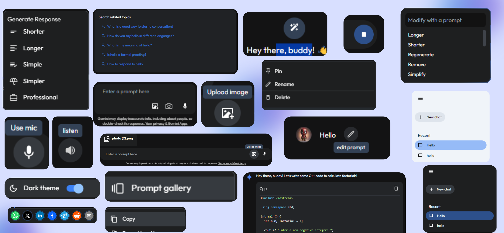

# Advanced Gemini Clone


An advanced GEMINI Clone built with Next.js, featuring enhanced functionalities and faster response times.

## Table of Contents
- [Overview](#overview)
- [Features](#features)
- [Technology Stack](#technology-stack)
- [Getting Started](#getting-started)
- [Usage](#usage)
- [License](#license)

## Overview

This project is an advanced recreation of the GEMINI AI platform, leveraging Next.js as a full-stack React framework. It incorporates all core functionalities of the actual GEMINI while providing natural, optimized responses that outperform the original in terms of speed.

## Features


### Authentication and State Management
- 🔐 Robust authentication using Next Auth v5
- 🔄 Efficient state management with Zustand

### User Interface and Experience
- ✨ Micro-animations powered by Framer Motion
- 🎨 Custom in-house components for UI flexibility
- 🌓 Dark and light mode toggle
- 📱 Fully responsive design for both desktop and mobile

### Chat Functionality
- 💬 Advanced chat features including rename, delete, and pin
- 🗣️ Text-to-speech and speech-to-text capabilities
- 🔗 Share chats and copy to clipboard
- ⏹️ Abort functionality for stopping responses
- 🖼️ Chat with images, including mobile support
- 🔄 Response modification and regeneration

### Advanced Features
- 🎭 Prompt Gallery for model-specific outputs
- ✏️ Edit Prompt functionality
- 🌈 Syntax highlighting for code outputs
- 💡 Random prompt suggestions on homepage

## Technology Stack

- **Frontend Framework**: Next.js (React)
- **Authentication**: Next Auth v5
- **State Management**: Zustand
- **Animations**: Framer Motion
- **UI Components**: Custom dev-components
- **Theming**: Next Themes

## Getting Started

To get a local copy up and running, follow these steps:

```bash
# Clone the repository
git clone https://github.com/yourusername/dev-gemini-clone.git

# Navigate to the project directory
cd dev-gemini-clone

# Install dependencies
npm install

# Start the development server
npm run dev